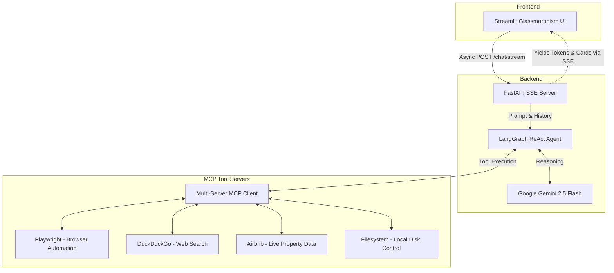

# Smart MCP: Autonomous AI Assistant

**Smart MCP** is a state-of-the-art, production-ready AI Assistant that bridges the gap between Large Language Models and real-world execution. Powered by **Google Gemini 2.5 Flash** and **LangGraph**, it leverages the modern **Model Context Protocol (MCP)** to seamlessly interface with local system files, headless browsers, web scraping vectors, and live API endpoints. 

The architecture features an ultra-responsive, glassmorphism-themed **Streamlit Frontend** that consumes an asynchronous **FastAPI Server-Sent Events (SSE)** backend, providing native, word-by-word token streaming and real-time tool execution visibility.

---

## 🌟 Key Features

- **Google Gemini 2.5 Intelligence:** High-speed native JSON tool-calling without model-side formatting hallucinations.
- **Model Context Protocol (MCP) Integration:** Dynamically connects to decoupled tool servers strictly via `stdio` configurations.
- **Deep ReAct Reasoning Loop:** Powered by `create_react_agent` under `LangGraph`, running multi-step reasoning cycles dynamically.
- **True Real-time Token Streaming:** Seamless chunk-by-chunk token processing delivered from backend to frontend without any lag.
- **Aesthetic UI/UX:** A gorgeous dark-mode dashboard tailored using custom CSS/HTML injection for immediate, immersive user feedback.

---

## 🏗️ System Architecture

Smart MCP operates on a strictly decoupled front-to-back philosophy. The LangGraph engine persists connections to your MCP servers via a singleton pattern, completely eliminating cold-start latency during consecutive chats.



---

## 🛠️ Included MCP Servers

The project is currently configured to connect to 4 primary MCP server architectures:
1. **`@playwright/mcp`**: Spins up headless browsers to navigate webpages, inspect DOM trees, and capture screenshots.
2. **`duckduckgo-mcp-server`**: Executes real-time web searches and news aggregation directly via the DuckDuckGo engine.
3. **`@openbnb/mcp-server-airbnb`**: Scrapes and provides live, structured Airbnb listings (with built-in `robots.txt` bypasses).
4. **`@modelcontextprotocol/server-filesystem`**: Safely sandboxes the AI to read, write, and traverse strictly allowed directories (like your Project Root and Desktop).

---

## 🚀 Getting Started

### 1. Prerequisites
- **Python 3.10+**
- **Node.js 20+** (Required for the `npx` MCP background server processes)
- **Google Gemini API Key**

### 2. Installation Setup

Clone the repository and install the Python dependencies:
```bash
git clone https://github.com/your-username/smart-mcp.git
cd smart-mcp
pip install -r requirements.txt
```

### 3. Environment Configuration
Create a `.env` file in the root directory and add your generated API Key:
```env
GEMINI_API_KEY=your_gemini_api_key_here
PYTHONUTF8=1
```

*(Note: Ensure your `mcp_config.json` points to valid local directories on your machine for the filesystem server).*

### 4. Running the Application

Because of the architectural separation, you must run both the backend and frontend simultaneously.

**Start the FastAPI Backend:**
```bash
uvicorn main:app --reload --port 8000
```

**Start the Streamlit Frontend (In a separate terminal):**
```bash
streamlit run app.py
```

Navigate to `http://localhost:8501` in your browser to begin conversing with your autonomous agent!

---

## 🛡️ Best Practices & Limitations
- **Google Quota Rates:** The Gemini Free Tier enforces a strict request limit (e.g. ~15 RPM). Multi-turn tool loops (like Playwright searching) can quickly exhaust this free tier limit. 
- **Security Sandboxing:** The AI's `filesystem` capabilities are forcibly isolated to the paths you define in `mcp_config.json`. Do not map it to root (`C:\`) to prevent unintentional operations.
